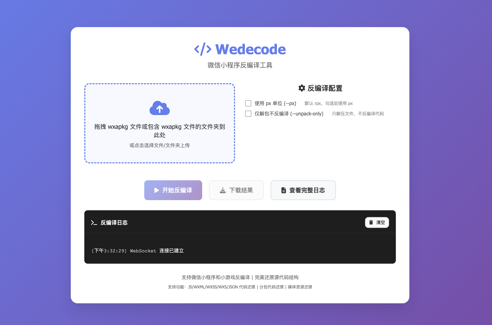

<h1 align="center">Wedecode</h1>
<br/>
<p align="center">
    <a href="https://npmjs.com/package/wedecode">
        
    </a>
    <a href="https://img.shields.io/npm/l/wedecode">
      
    </a>
   

</p>
<br/>


**微信 `wxapkg` 反编译工具，已经支持大多数小程序完美还原**

**`Windows` `MacOS` `Linux` 跨平台支持**

## 支持功能

SUPPORT

- [x] **支持 `小程序` 还原**
- [x] **支持 `小游戏` 还原**
- [x] **支持分包代码和插件代码还原**
- [x] **完美还原目录结构和源代码**
  - [x] **`JS` 代码还原**
  - [x] **`WXML` 代码还原**
  - [x] **`WXSS` 代码还原**
  - [x] **`WXS` 代码还原**
  - [x] **`JSON` 文件还原**
- [x] **其他类型文件还原 ( 媒体资源，wasm, workers...等 )**
- [x] **所有代码美化输出**
- [x] **小程序包扫描**
- [x] **可视化UI操作**

TODO

- [ ] 小程序自动解密( 最近几年的电脑端包都不需要解密，以后看情况跟进 )


## 方式一:  在线运行方式



如果你不想安装 Wedecode 工具， 可以直接在 GitHub 上运行可视化版本

> 运行方式: `本界面右上角 Use this template` -> `Open in a codespace`   


之后等待 codespace 初始化完成就行了, 启动后会自动安装一些环境依赖，过程可能会比较久， 请耐心等待  

等网页编辑器初始化完成后，打开终端执行  `npm run ui`  

之后 `ctrl + 鼠标左键` 打开终端上显示的 `http://localhost:3000` 即可使用可视化操作页面

## 方式二:  本地电脑安装

### 准备

该工具只能在有 `nodejs` 环境设备上运行， 如果您还没有 `nodejs` 环境，点这里 [去准备环境](https://nodejs.org/)  
nodejs 版本最好使用 v18+  

### 安装工具

全局安装， 安装完成后在任意终端都可使用

```shell
# window
  npm i wedecode -g
# mac
  sudo npm i wedecode -g
```

### 运行

命令行打开可视化操作页面
```shell
  wedecode ui
```

命令行直接输入 wedecode 即可运行, 全程自动引导

```shell
  wedecode
```

命令行直接指定参数

```shell
# 手动指定一个包
  wedecode ./name.wxapkg
# 或者  编译当前命令行所在文件夹内的所有包
  wedecode ./
# 或者  编译当前命令行所在文件夹下名为 dirname 文件夹的所有包
  wedecode ./dirname
# 或者: 将编译结果输出到指定目录 --out 为输出目录
  wedecode ./  --out ./output_path
# 你也可以预设任意命令行参数， 在交互时将不会向您提问， 例如
  wedecode --out output_path --clear --open-dir
```

使用源码运行

```shell
  git clone https://github.com/biggerstar/wedecode
  npm install  # 如果 npm 安装很慢， 可以使用右侧命令换国内的淘宝源  npm config set registry https://registry.npmmirror.com
  npm run start
  # 或 
  npm run ui
```

### 命令参数

| 参数                  | 作用                         |
|---------------------|----------------------------|
| `ui`                | 启动本地可视化操作页面            |
| `<packages...>`     | 包所在路径，可以是文件或者目录            |
| `-o, --out  <path>` | 产物及输出路径， 未指定默认放到同级目录下的 OUTPUT |
| `--open-dir`        | 结束编译后打开查看产物目录               |
| `--clear`           | 是否清空旧产物                    |
| `--px`              | 是否使用 px 像素单位解析 css， 默认使用的是 rpx 单位 |
| `--unpack-only`     | 是否只进行解包，不进行反编译             |

### polyfill

在编译过程中， 在包所在文件夹在创建一个 polyfill 目录，如果发现里面的模块和输出到产物中的模块路径名称一致，
将会使用自定义的js模块，忽略原本js模块的编译

```
小程序包所在位置目录结构
  
├── target_dir  
│   ├── xxx.wxapkg    
│   ├── xxx-sub.wxapkg    
│   └── polyfill/  
│       └── @babel/    
│           └── array.js    

```

```
输出产物目录结构   

├── OUTPUT  
│   ├─ app.json  
│   ├─ pages/  
│   ├─ components/  
│   ├─ @babel/  
│      └── array.js
```

### QA

1. Q: 为何编译出来好多文件只有默认模板?  
   A: 这可能是缺失分包，你需要把分包放在一起编译， 你可以在 app.config.json 或者 app.json 文件中查看你依赖的分包信息,    
   在编译产物中出现默认模板是因为小程序会检查依赖，为了保证在缺失某些分包的情况下正常运行而生成的默认模板

### 免责声明

该工具仅限用于: 线上代码安全审计以便快速发现漏洞, 学习反编译原理,  
请遵守国家法律, 严禁任何非法用途,  
若你使用的范围不在国家法律允许的范围内， 造成的一切法律后果与作者无关。  
